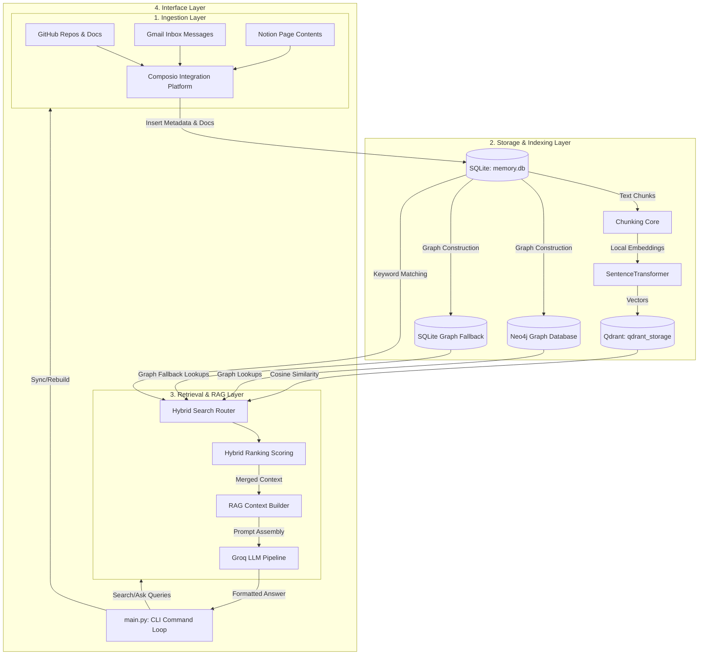

# Memory‑OS 🧠


**Memory‑OS** is a local Personal Knowledge Operating System that syncs, indexes, and retrieves information across your GitHub repositories, emails, and Notion workspaces. It runs a unified interactive CLI, exposing hybrid keyword + semantic search and natural language QA powered by RAG, local embeddings, and a knowledge graph.

---

## 🏗️ Architecture

Memory-OS is built as a modular architecture consisting of ingestion, databases, scoring ranking engines, and a terminal user loop:



---

## 🗄️ Database Technology Rationale

Memory-OS adopts a **multi-model storage engine strategy**, selecting each technology to excel at its designated retrieve-and-rank role:

| Database | Selection Rationale |
| :--- | :--- |
| **SQLite (`memory.db`)** | Chosen for lightweight, serverless relational structured storage. It holds raw documents, chunk segments, email metadata, and repository statistics, providing ACID compliance and ultra-fast exact keyword searches. |
| **Qdrant (`qdrant_storage`)** | Chosen as a high-performance vector database optimized for storing and executing cosine similarity search queries on $384$-dimensional dense vector embeddings generated by Sentence-Transformers. |
| **Neo4j / Fallback SQLite** | Neo4j is utilized as a native graph database to map complex developer relationships (e.g. `Repository-[USES]->Technology` or `Email-[SENT_BY]->User`). If the Neo4j instance is unreachable, it seamlessly falls back to a relational SQLite graph schema (`memory.db`), preserving search functionality offline. |

---

## 📦 Setup Instructions

Ensure you have Python 3.10+ installed.

### 1. Install Dependencies
We recommend using `uv` or `pip` to manage dependencies in a local virtual environment:
```bash
# Clone the repository
git clone https://github.com/anirudh-pedro/Memory-OS.git
cd Memory-OS

# Initialize virtual environment
python -m venv .venv
source .venv/bin/activate  # On Windows: .venv\Scripts\activate

# Install requirements
pip install -r requirements.txt
```

### 2. Configure Environment Variables
Create a `.env` file in the root directory:
```ini
# Core API Keys
GROQ_API_KEY_1=gsk_...
GROQ_API_KEY_2=gsk_...   # key rotation fallback
COMPOSIO_API_KEY=comp_...

# Graph Configuration
NEO4J_URI=bolt://localhost:7687
NEO4J_USER=neo4j
NEO4J_PASSWORD=your_password

# Ranking Tuning
REPO_SCORE_BOOST=1.0
EMAIL_SCORE_WEIGHT=1.0
DEBUG=false
```

---

## 🚀 Available CLI Commands

Start the interactive CLI:
```bash
python main.py
```

Inside the interactive shell:
```text
sync                      # Incremental sync from all sources (GitHub, Gmail, Notion)
sync --rebuild            # Full reset and rebuild of SQLite, Qdrant, and Graph DBs
stats                     # Shows DB counts for repos, docs, emails
search <query>            # Hybrid search across knowledge base
semantic-search <query>   # Perform a semantic search in vector store (limit=5)
ask <question>            # Query the hybrid retrieval RAG pipeline
repo-info <repo>          # Show metadata and synced files for a repository
repo-readme <repo>        # View README of a repository
repo-files <repo>         # List synced files for a repository
project-tech <repo>       # List detected technologies for a repository
projects                  # List all indexed repositories
tech-stack                # List all detected technologies across repos
project-search <tech>     # Find repositories using a specific technology
graph <repo>              # Show knowledge graph relationships for a repository
graph-tech <tech>         # Show knowledge graph relationships for a technology
graph-person <person>     # Show knowledge graph relationships for a contributor/sender
relations <entity>        # Search all graph relationships matching an entity
debug-index <repo>        # Lists documents, chunk counts, and total vectors for a repo
debug-vector <repo>       # Prints the first 5 stored chunks for a repo
debug-retrieval <query>   # Show raw vector hits, scores, and ranking reasons
vector-stats              # Shows Qdrant collection stats
delete --before YYYY-MM-D # Delete records older than a date
reset                     # Reset all local storage (DB and Qdrant)
exit                      # Quit the interactive shell
```

---

## 📝 Sample CLI Session

```text
Initializing embedding model...
System ready.

==================================================
🧠 MEMORY-OS CLI
==================================================
...

You: stats
========================================
MEMORY-OS STATS
========================================
Repositories: 8
Documents: 48
Emails: 52
========================================

You: graph Memory-OS
========================================
GRAPH RELATIONSHIPS FOR REPOSITORY: Memory-OS
========================================
- Repository 'Memory-OS' CONTAINS Document 'README.md'
- Repository 'Memory-OS' CONTAINS Document 'pyproject.toml'
- Repository 'Memory-OS' USES Technology 'Composio'
- Repository 'Memory-OS' USES Technology 'Docker'
- Repository 'Memory-OS' USES Technology 'Groq'
- Repository 'Memory-OS' USES Technology 'LangChain'
- Repository 'Memory-OS' USES Technology 'Neo4j'
- Repository 'Memory-OS' USES Technology 'Python'
- Repository 'Memory-OS' USES Technology 'Qdrant'
- Repository 'Memory-OS' USES Technology 'SQLite'
========================================

You: ask Which technologies does Memory-OS use?
Retrieval Duration: 0.0825s
LLM Generation Duration: 1.05s
Total RAG Pipeline Duration: 1.13s
========================================
ANSWER
========================================
Memory-OS uses Sentence‑Transformers embeddings and Qdrant vector storage, along with other technologies such as composio, langchain, python-dotenv, and neo4j.

========================================
SOURCES
========================================
- README.md
- pyproject.toml

========================================
REPOSITORIES USED
========================================
- Memory-OS

========================================
Confidence: 0.90
========================================

You: exit
Closing resources...
Goodbye!
```

---

## 📜 License
This project is licensed under the **MIT License**.
