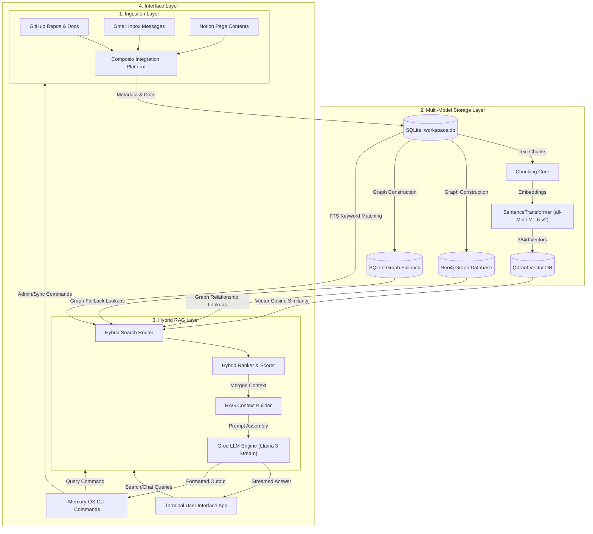

# Memory‑OS 🧠

[](https://pypi.org/project/cli-memory-os/)
[](https://opensource.org/licenses/MIT)
[](https://www.python.org/)

**Memory‑OS** is a local Personal Knowledge Operating System that automatically syncs, indexes, and retrieves information across your **GitHub** repositories, **Gmail** inbox messages, and **Notion** workspaces.

It provides both a command-line interface (CLI) and an interactive Terminal User Interface (TUI) powered by **Hybrid RAG** (Keyword + Vector + Knowledge Graph), local embeddings via SentenceTransformers, and ultra-fast LLM generation via the Groq API.

---

## ✨ Features

- **🌐 Multi-Source Ingestion**: Sync repositories, issues, PRs, emails, and Notion pages via Composio OAuth connectors.
- **⚡ Hybrid RAG Retrieval**: Combines **SQLite** (Keyword & Full-Text Search), **Qdrant** (Vector Similarity Search), and **Neo4j / SQLite Graph** (Knowledge Graph relationship lookups).
- **🤖 Groq LLM Integration**: Uses Groq's high-speed LLM inference (`llama-3.3-70b-versatile`, `llama-3.1-8b-instant`) with streaming responses.
- **🎨 Interactive Terminal User Interface (TUI)**: Beautiful full-screen terminal app built with Textual, featuring chat streaming, live diagnostics, and sidebar navigation.
- **🛡️ Robust Offline Fallbacks**: Gracefully degrades to local SQLite storage and local SQLite Graph when Docker database services or Neo4j are offline.
- **📁 Multi-Profile Workspaces**: Easily create, list, and switch between separate knowledge profile contexts.
- **📦 Portability**: Export and import complete knowledge bases into single compressed archive files.

---

## 🏗️ Architecture


```mermaid
flowchart TD
    subgraph Ingestion [1. Ingestion Layer]
        GH[GitHub Repos & Docs]
        GM[Gmail Inbox Messages]
        NT[Notion Page Contents]
        CP[Composio Integration Platform]
        GH --> CP
        GM --> CP
        NT --> CP
    end

    subgraph Storage [2. Multi-Model Storage Layer]
        DB[(SQLite: workspace.db)]
        QD[(Qdrant Vector DB)]
        N4J[(Neo4j Graph Database)]
        SQL_G[(SQLite Graph Fallback)]
        
        CP -->|Metadata & Docs| DB
        DB -->|Text Chunks| CH[Chunking Core]
        CH -->|Embeddings| EM["SentenceTransformer (all-MiniLM-L6-v2)"]
        EM -->|384d Vectors| QD
        
        DB -->|Graph Construction| N4J
        DB -->|Graph Construction| SQL_G
    end

    subgraph Retrieval [3. Hybrid RAG Layer]
        HS[Hybrid Search Router]
        QD -->|Vector Cosine Similarity| HS
        DB -->|FTS Keyword Matching| HS
        N4J -->|Graph Relationship Lookups| HS
        SQL_G -->|Graph Fallback Lookups| HS
        
        HR[Hybrid Ranker & Scorer]
        HS --> HR
        
        RAG[RAG Context Builder]
        HR -->|Merged Context| RAG
        
        LLM["Groq LLM Engine (Llama 3 Stream)"]
        RAG -->|Prompt Assembly| LLM
    end

    subgraph Interface [4. Interface Layer]
        TUI[Terminal User Interface App]
        CLI[Memory-OS CLI Commands]
        
        TUI -->|Search/Chat Queries| Retrieval
        CLI -->|Admin/Sync Commands| Ingestion
        CLI -->|Query Command| Retrieval
        LLM -->|Streamed Answer| TUI
        LLM -->|Formatted Output| CLI
    end
```

---

## 📦 Installation & Quick Start

### 1. Install via PyPI
```bash
pip install --upgrade cli-memory-os
```

### 2. Run the Onboarding Wizard
Initialize your workspace, set up database storage, configure API keys (**Groq** & **Composio**), and authorize connectors:
```bash
memory-os init
```

### 3. Sync Your Data
Import your documents, emails, and repositories:
```bash
memory-os sync
```

### 4. Ask Questions or Launch the Interactive TUI
Ask a quick question from the terminal:
```bash
memory-os ask "What was discussed in my latest emails about project deployment?"
```

Or launch the full interactive terminal application:
```bash
memory-os
```

---

## 🖥️ Interactive Terminal Application (TUI)

Launch the full-screen terminal interface by running `memory-os` without arguments.

Features of the TUI:
- **💬 Chat Panel**: Ask questions with real-time token streaming and expandable source citations.
- **📊 Overview Dashboard**: Monitor total indexed repositories, documents, emails, vectors, and active model configs.
- **🩺 Diagnostics Panel**: Run line-by-line connection health checks for local databases, LLM APIs, and connectors.
- **⚙️ Config Manager**: View and inspect active TOML configuration settings.

---

## 🗄️ Database Strategy

Memory-OS employs a **multi-model storage strategy**:

| Engine | Role & Rationale |
| :--- | :--- |
| **SQLite (`workspace.db`)** | Primary structured storage for document chunks, metadata, and full-text keyword indexing with fast ACID transactions. |
| **Qdrant** | High-performance vector database storing 384-dimensional dense vector embeddings generated locally by `all-MiniLM-L6-v2`. |
| **Neo4j / SQLite Graph** | Native property graph for mapping relationships (`Repository-[USES]->Technology` or `Email-[SENT_BY]->User`). Seamlessly falls back to a relational SQLite graph schema when Neo4j is offline. |

---

## 🚀 CLI Commands Reference

| Category | Command | Description |
| :--- | :--- | :--- |
| **App & TUI** | `memory-os` | Launches the interactive terminal user interface. |
| **Setup & Core** | `memory-os init` | Guided onboarding wizard for dependencies, Docker, API keys, and connectors. |
| | `memory-os start` | Starts background Docker Compose database services (Neo4j, Qdrant). |
| | `memory-os stop` | Stops background Docker Compose database services. |
| | `memory-os restart` | Restarts database services. |
| **Operations** | `memory-os sync [--source SOURCE] [--rebuild]` | Incremental or full data synchronization from GitHub, Gmail, or Notion. |
| | `memory-os ask <question>` | Queries the knowledge base using the Hybrid RAG engine. |
| **Diagnostics** | `memory-os doctor` | Comprehensive health check across Python, Docker, databases, LLMs, and API keys. |
| | `memory-os status` | Displays indexed counts (repos, docs, emails, vectors, embedding models). |
| | `memory-os monitor` | Aggregates log metrics (indexing speeds, search rates, LLM response latencies). |
| | `memory-os benchmark` | Runs performance benchmarks across keyword, vector, hybrid, and RAG pipelines. |
| | `memory-os logs [--tail N]` | Views system logs with rotation support. |
| **Config & Workspace**| `memory-os config show\|get\|set\|reset` | Inspects, modifies, or resets settings in `~/.memory-os/config.toml`. |
| | `memory-os workspace list\|create\|switch\|delete\|info` | Manages multiple isolated workspace profile directories. |
| | `memory-os export <file.zip>` | Compresses active workspace databases and configuration into a backup file. |
| | `memory-os import <file.zip>` | Restores a workspace profile from a backup zip archive. |
| | `memory-os plugins` | Lists all registered integration connector plugins. |
| | `memory-os version` | Displays installed package and system version information. |

---

## 🔌 Plugin Connector Architecture

Every connector inherits from `BaseConnector` (`connectors/base.py`) and registers via `@register` (`connectors/registry.py`):

```python
from connectors.base import BaseConnector
from connectors.registry import register

@register
class SlackConnector(BaseConnector):
    name = "Slack"
    slug = "slack"

    def authenticate(self) -> bool:
        # Perform OAuth or API validation
        return True

    def sync(self) -> dict:
        # Fetch messages and documents
        return {"synced": 42}

    def health(self) -> tuple[bool, str]:
        return True, "Connected"
```

---

## 🛠️ Configuration & Customization

Settings are managed under `~/.memory-os/config.toml`:

```toml
[groq]
api_key = "gsk_..."
model = "llama-3.3-70b-versatile"

[composio]
api_key = "ak_..."

[vector]
provider = "qdrant"
host = "localhost"
port = 6333
embedding_model = "sentence-transformers/all-MiniLM-L6-v2"
```

To update settings directly from the terminal:
```bash
memory-os config set groq.model llama-3.1-8b-instant
```

---

## 📜 License

This project is licensed under the **MIT License**.
