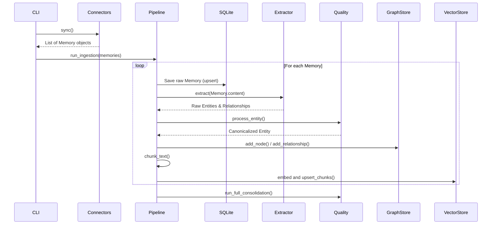
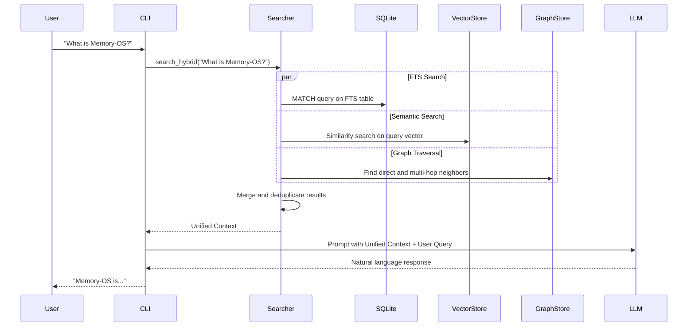

# Data Flow

This document outlines how data moves through the Memory-OS system, from ingestion to query answering.

## 1. Ingestion Lifecycle

The ingestion process is orchestrated by the `IngestionPipeline` (`core/pipeline.py`).

## 2. Retrieval Lifecycle (Hybrid Search)

When a user asks a question, the `HybridSearcher` (`retrieval/searcher.py`) runs queries across all databases simultaneously.

## 3. Deletion Lifecycle

When a user runs `delete --before YYYY-MM-DD`, the system prunes old data across all stores.

1.  **SQLite**: Deletes rows from `workspace_cache` and `events` where timestamps are older than the specified date.
2.  **Graph Store**: Deletes nodes older than the date. (Cascading deletes automatically handle orphaned relationships in both SQLite and Neo4j).
3.  **Vector Store**: Uses Qdrant filters to delete points based on the `last_synced` metadata payload.
