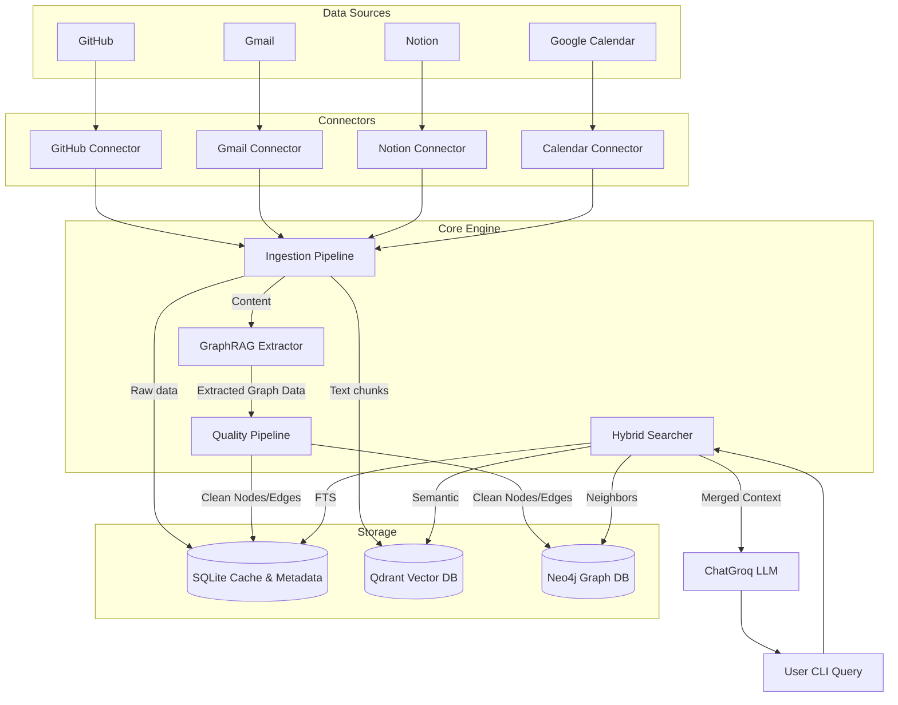

# Architecture Overview

Memory-OS is a CLI-based Personal Knowledge Operating System (PKOS). Its primary function is to ingest data from multiple external sources (GitHub, Gmail, Notion, Google Calendar), extract semantic and graph representations, and serve as an intelligent, locally-first search engine via LLM-powered natural language queries.

## High-Level System Architecture

## Three-Pillar Storage Strategy

Memory-OS utilizes three distinct storage technologies to power its retrieval system:

1.  **SQLite (`metadata.db`)**:
    *   Serves as the raw data cache (`workspace_cache`).
    *   Maintains the canonical record of Entities and Relationships (acting as a local graph fallback if Neo4j is offline).
    *   Provides Full-Text Search (FTS5) capabilities over raw documents.
    *   Logs system events via the Event Sourcing layer.
2.  **Qdrant**:
    *   Stores embedded document chunks.
    *   Enables dense vector similarity search to find semantically related context.
    *   Supports dynamic embedder models (TF-IDF, BGE, E5, Nomic).
3.  **Neo4j** (Optional but recommended):
    *   Provides native, highly-performant graph traversals.
    *   Stores validated nodes (Entities) and edges (Relationships).
    *   Enables multi-hop neighbor discovery during retrieval.
